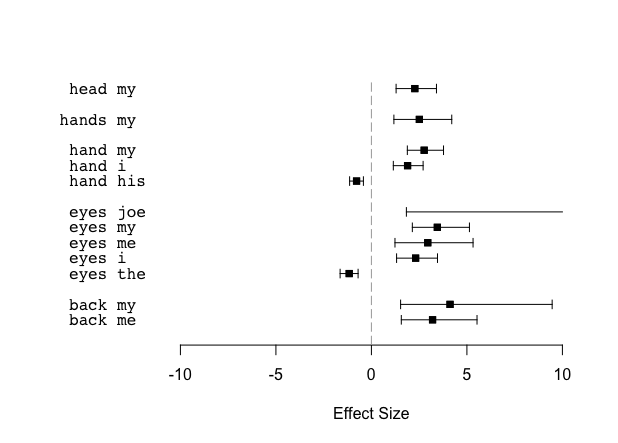

  
CorporaCoCo
===========

A set of functions used to compare co-occurrence between two corpora.

The package is the result of work by the [Centre for Corpus Research](http://www.birmingham.ac.uk/research/activity/corpus/) at the University of Birmingham.  There is a paper in preparation but for now a good place to get an idea of what is going on is the 'Proof of Concept' document.

A very simple example of usage
------------------------------

This example takes the two Dickens novels 'Great Expectations' and 'A Tale of Two Cities' and compares the co-occurrences of a set of body part nouns. The idea is that since body part nouns are common in speech suspensions the statistically significant co-occurrence differences should include personal pronouns reflecting the differing narrative voices of the texts.

    library(CorporaCoCo)
    library(jsonlite)

    get_book_tokens <- function(shortname) {
        base_uri <- 'http://clic.bham.ac.uk/api'
        json <- fromJSON(paste0(base_uri, "/subset?corpora=", shortname))
        tokens <- tolower( unlist( sapply(json$data, function(x) {
            head(x[[1]], -1)[as.integer(tail(x[[1]], 1)[[1]])+1]
        }) ) )
    }

    GE <- get_book_tokens('GE')
    TTC <- get_book_tokens('TTC')

    nodes <- c('back', 'eye', 'eyes', 'forehead', 'hand', 'hands', 'head', 'shoulder')

    results <- surface_coco(TTC, GE, span = '5LR', nodes = nodes, fdr = 0.01)
    results

    ##          x   y H_A  M_A H_B  M_B effect_size  CI_lower   CI_upper      p_value   p_adjusted
    ##   1:  back  me   3 1337  49 2341    3.221181  1.584866  5.5489805 5.440975e-07 5.283187e-04
    ##   2:  eyes   i  10 1640  53 1737    2.322489  1.326370  3.4680980 1.290817e-07 5.963576e-05
    ##   3:  eyes joe   0 1650  16 1774         Inf  1.839353        Inf 3.552572e-05 6.691836e-03
    ##   4:  eyes  me   3 1647  25 1765    2.958423  1.241832  5.3326117 3.621123e-05 6.691836e-03
    ##   5:  eyes  my   5 1645  57 1733    3.434699  2.123620  5.1159658 9.752564e-12 9.011369e-09
    ##   6:  eyes the 123 1527  62 1728   -1.166398 -1.642460 -0.7024399 2.098712e-07 6.464034e-05
    ##   7:  hand his 176 2294 114 2536   -0.771065 -1.133959 -0.4126876 1.250677e-05 4.744234e-03
    ##   8:  hand   i  19 2451  75 2575    1.909259  1.162857  2.7232409 1.629910e-08 9.274188e-06
    ##   9:  hand  my  13 2457  85 2565    2.646457  1.791317  3.6168202 1.860637e-13 2.117405e-10
    ##  10: hands  my   5 1125  45 1775    2.511311  1.177037  4.2063750 1.127123e-05 9.321308e-03
    ##  11:  head  my  10 1710  61 2169    2.265311  1.284027  3.3998354 1.607393e-07 1.689370e-04

    plot(results)

Installing from CRAN
====================

In an R session type

    install.packages('CorporaCoCo')

Installing the latest development version directly from GitHub
==============================================================

Linux
-----

In an R session type:

    pkg_file <- tempfile()
    download.file(url = 'https://github.com/birmingham-ccr/CorporaCoCo/archive/master.tar.gz', mode = 'wb', method = 'wget', destfile = pkg_file)
    install.packages(pkg_file, repos = NULL, type = 'source')

Mac OSX / Windows
-----------------

``download.file`` may not support fetching ``https`` URLs. Alternatively, you
can use the the CRAN package [downloader](https://CRAN.R-project.org/package=downloader)
to fetch the archive instead:

    # install.packages("downloader")
    pkg_file <- tempfile()
    downloader::download(url = 'https://github.com/birmingham-ccr/CorporaCoCo/archive/master.tar.gz', mode = 'wb', destfile = pkg_file)
    install.packages(pkg_file, repos = NULL, type = 'source')

Alternatively use the `devtools` CRAN package
---------------------------------------------

If you have the CRAN package [devtools](https://CRAN.R-project.org/package=devtools)
you can use this to install directly from github:

    # install.packages("devtools")
    devtools::install_github("birmingham-ccr/CorporaCoCo")

Testing
=======

Unit tests are located in the /tests/ directory. There's a [shared functions](tests/shared_functions.R) file for common functions used across multiple test files, and a set of test files prefixed with 'test_' for each of the relevant files in the [R](/R) directory.

Continuous integration testing is set up using Travis CI. See [the Travis CI congiruation file](/.travis.yml).

Linting is performed using lintr. See [the lintr configuration file](/.lintr).

